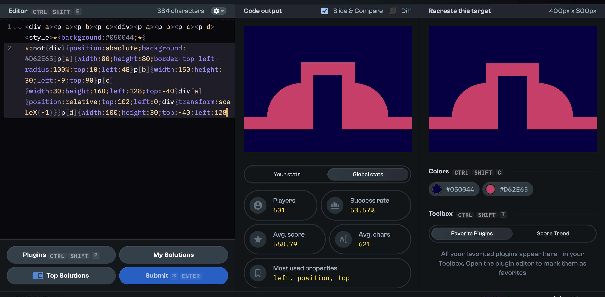
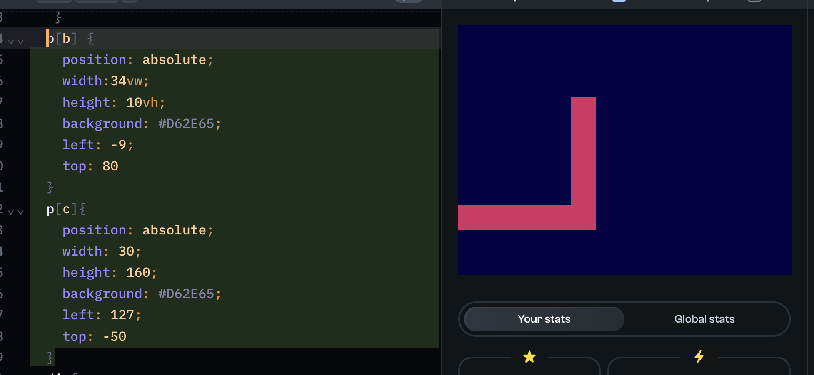
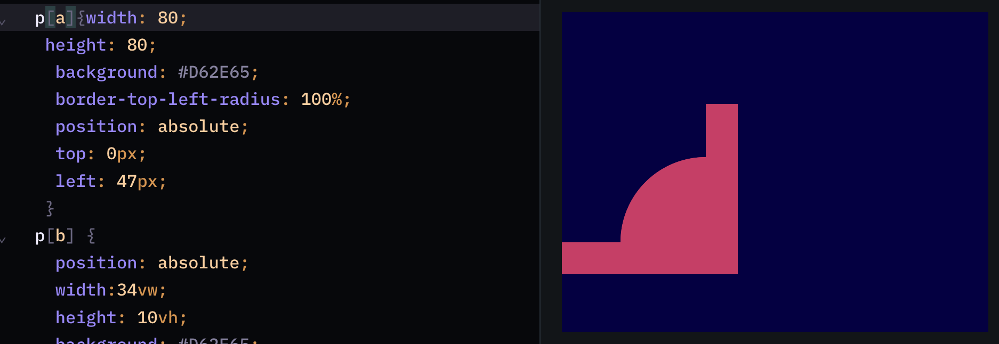
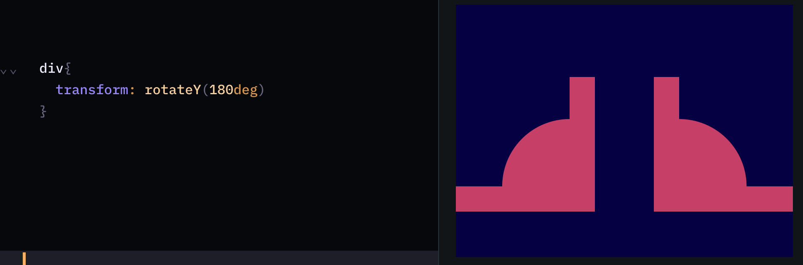
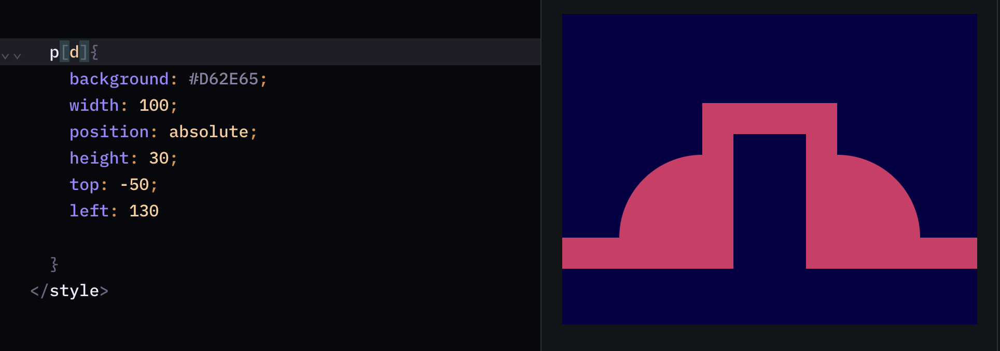

### My solution
[Play the challenge](https://cssbattle.dev/play/hTcOgzNi1XUkGiJVQFXG)

### My solution

***99.7% match, 384 characters***
```html
<div a><p a><p b><p c><div><p a><p b><p c><p d><style>*{background:#050044;*{*:not(div){position:absolute;background: #D62E65}p[a]{width:80;height:80;border-top-left-radius:100%;top:10;left:48}p[b]{width:150;height: 30;left:-9;top:90}p[c]{width:30;height:160;left:128;top:-40}div[a]{position:relative;top:102;left:0;div{transform:scaleX(-1)}}p[d]{width:100;height:30;top:-40;left:128
```



#### Explanation:
- Make sure you [understand the CSSBattle environment](https://github.com/bugb/css-battle/tree/main)
- The ungolfed version looks like this:

```html
<div a>
  <p a></p>
  <p b></p>
  <p c></p>
</div>
<div>
  <p a></p>
  <p b></p>
  <p c></p>
</div>
<p d>
<style>
  * {
      background: #050044
    };
  p[a] {
    width: 80px;
    height: 80px;
    background: #D62E65;
    border-top-left-radius: 100%;
    position: absolute;
    top: 0px;
    left: 47px;
  }
  p[b] {
    position: absolute;
    width:34vw;
    height: 10vh;
    background: #D62E65;
    left: -9px;
    top: 80px;
  }
  p[c] {
    position: absolute;
    width: 30px;
    height: 160px;
    background: #D62E65;
    left: 127px;
    top: -50px;
  }
  div[a] {
    position: relative;
    margin-top:120px;
    margin-left:0px;
  }
  div {
    transform:scaleX(-1);
  }
  p[d] {
    background: #D62E65;
    width: 100px;
    position: absolute;
    height: 30px;
    top: -50px;
    left: 130px;
  }
</style>
```

#### Syntax Overview

- We use [CSS selectors tip](../../README.md#2-attribute-selectors)

#### Step-by-Step Breakdown
##### 1. Create the right‑angle shape on the left while styling `p[a]` and `p[b]`

This could also be done with CSS borders (e.g. using only bottom and right borders), but the current approach keeps values explicit.

##### 2. Add the quarter circle using `border-top-left-radius:100%`


##### 3. Flip the group from steps 1 and 2 to the right with `transform: scaleX(-1)`


##### 4. Add the final missing rectangle (`p[d]`)


### Top 10 solutions (maximum 170 characters):
#### 1. [PINPAL](https://cssbattle.dev/player/pinpal)
```html
<style>*{background:#050044;border:solid+5ic#D62E65;border-radius:7lh/8pc;margin:34%56;*{corner-shape:notch;margin:-128-168-9in;font:6px/4'
```
#### 2. [H_Bliertz](https://cssbattle.dev/player/h_blierzt)
```html
<stylE>*{background:#050044;border-radius:21pc/21em;border:solid 5em#D62E65;margin:34%56;*{corner-shape:notch;margin:-128-336-800;font:38%'
```
#### 3. [James Whitehead](https://cssbattle.dev/player/wi328v9RQHXQ73SxzWKIKa6m6jg1)
```html
<style>*{background:#050044;border:solid 5em#D62E65;border-radius:7lh/8pc;margin:34%56;*{corner-shape:notch;margin:-128-168-250;font:6px/4'
```

#### 4. [Beo](https://cssbattle.dev/player/beo)
```html
<style>*{margin:34%56;border-radius:7lh/8pc;background:#050044;border:solid+5em#D62E65;*{margin:-128-612-300;corner-shape:notch;font:38%/14.39'
```

#### 5. [emohdaziz](https://cssbattle.dev/player/emohdaziz)
```html
<p>.<stYle>*{background:#050044;border:5em solid#d62e65}&{border-radius:5pc;margin:34%56;*{border-bottom:0;margin:0-185;*{margin:-36%155}font:2vh/8pc"
```

#### 6. [Veit Lehmann](https://cssbattle.dev/player/levito)
```html
<hr size=130><style>*{border:5em solid#D62E65;background:#050044}&{margin:34%56;border-radius:1in;*{margin:0-174;border-width:30 30 0;*{margin:-38%144
```

#### 7. [Ludvig](https://cssbattle.dev/player/ludvig)
```html
<hr size=130><STYLE>&{border-radius:5pc}*{background:#050044;margin:34%56;border:5em solid#D62E65;*{margin:0-166;border-width:30 30 0;*{margin:-158 136
```

#### 8. [David Eguiluz](https://cssbattle.dev/player/eguiluz)
```html
.....<a>. .......<style>&{border-radius:5pc;color:d62e65;border:5pc solid;margin:34%56;*{margin:-11-155;background:#050044;a{outline:32Q solid}font:17pc/8pc"
```

#### 9. [KoenH](https://cssbattle.dev/player/koenh)
```html
<p><style>&{border-radius:5em}*{background:#050044;border:var(--b,5em)solid#D62E65;margin:34%56;*{--b:32q;margin:0-200;height:8em;*{margin:-158 170;border-bottom:0
```

#### 10. [Martijn](https://cssbattle.dev/player/f9KZ3V3bdfaQx0oOfxY5VYVvLGW2)
```html
<p><style>*{background:#050044;border:var(--w,5pc)solid#D62E65;margin:136 56;border-radius:5em;*{margin:0-250;height:128;--w:32q;border-bottom:0;*{margin:-158 220;font:0'
```