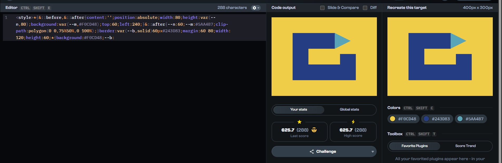
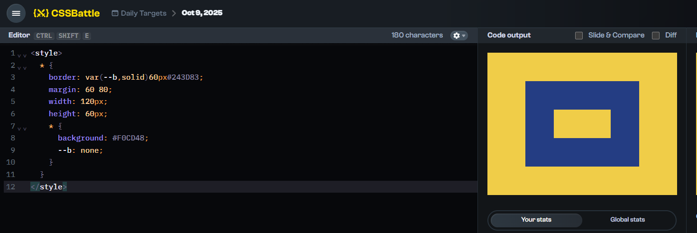
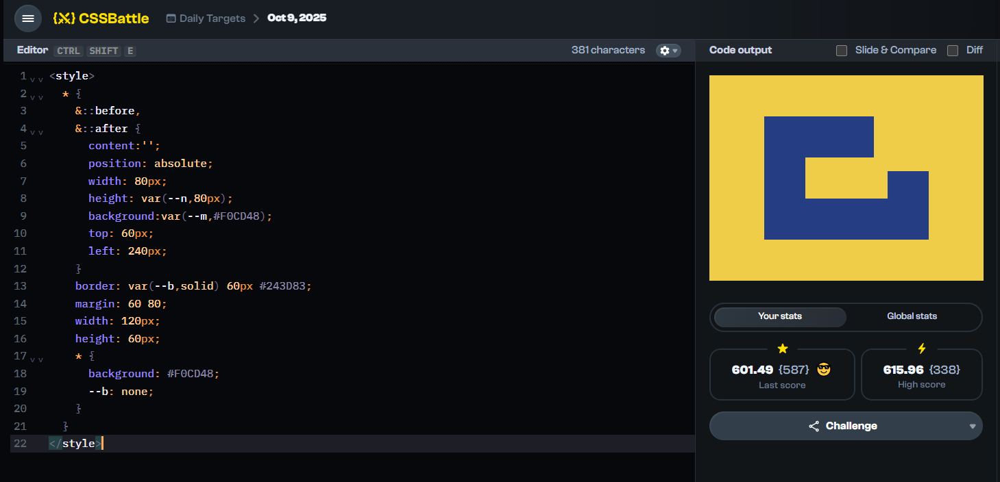
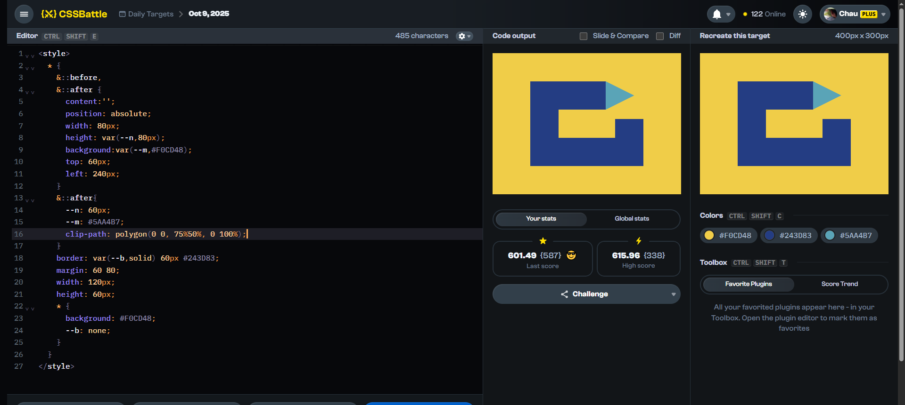

### My solution
[Play the challenge](https://cssbattle.dev/play/JifHruTv42KU6VSBoAKy)

### My solution

***100% match, 287 characters***
```html
<style>*{&::before,&::after{content:'';position:absolute;width:80;height:var(--n,80);background:var(--m,#F0CD48);top:60;left:240;}&::after{--n:60;--m:#5AA4B7;clip-path:polygon(0 0,75%50%,0 100%);}border:var(--b,solid)60px#243D83;margin:60 80;width:120;height:60;*{background:#F0CD48;--b:
```



#### Explanation:
- Make sure you [understand the CSSBattle environment](https://github.com/bugb/css-battle/tree/main)
- The ungolfed version looks like this:

```html
<style>  
  * {
    &::before,
    &::after {
      content:'';
      position: absolute;
      width: 80px;
      height: var(--n, 80px);
      background:var(--m, #F0CD48);
      top: 60px;
      left: 240px;
    }
    &::after{
      --n: 60px;
      --m: #5AA4B7;
      clip-path: polygon(0 0, 75%50%, 0 100%);
    }
    border: var(--b,solid) 60px #243D83;
    margin: 60 80;
    width: 120px;
    height: 60px;
    * {
      background: #F0CD48;
      --b: none;
    }
  }
</style>
```

#### Syntax Overview

- We use [CSS nesting with the `var` function](../../README.md#css-nesting-with-the-var-function) and  [the `&` selector](../../README.md#the--selector)

#### Step-by-Step Breakdown
##### 1. Create a border for the `html` element and set a background color for the `body`.
```css
<style>
  * {
    border: var(--b,solid) 60px #243D83;
    margin: 60 80;
    width: 120px;
    height: 60px;
    * {
      background: #F0CD48;
      --b: none;
    }
  }
</style>
```
- I first adjusted the border size along with the margin to match the portion of the output.

- Then, I set the width and height to match the output border.

- a small tip: `--b: none` is the same as `--b:`


Steps 2 and 3 use [Tree-Abiding pseudo-elements](https://developer.mozilla.org/en-US/docs/Web/CSS/Pseudo-elements#tree-abiding_pseudo-elements) so there's no need to add new elements to the DOM.

##### 2. Add a square element as an overlay above the HTML border
```diff
<style>  
+  * {
+    &::before,
+    &::after {
+      content:'';
+      position: absolute;
+      width: 80px;
+      height: var(--n,80px);
+      background:var(--m,#F0CD48);
+      top: 60px;
+      left: 240px;
+    }
    border: var(--b,solid) 60px #243D83;
    margin: 60 80;
    width: 120px;
    height: 60px;
    * {
      background: #F0CD48;
      --b: none;
    }
  }
</style>
```



##### 3. Add the triangle
There will have many ways but I use: `clip-path: polygon(0 0, 75%50%, 0 100%);`

```diff
<style>  
  * {
    &::before,
    &::after {
      content:'';
      position: absolute;
      width: 80px;
      height: var(--n,80px);
      background:var(--m,#F0CD48);
      top: 60px;
      left: 240px;
    }
+    &::after{
+      --n: 60px;
+      --m: #5AA4B7;
+      clip-path: polygon(0 0, 75%50%, 0 100%);
+    }
    border: var(--b,solid) 60px #243D83;
    margin: 60 80;
    width: 120px;
    height: 60px;
    * {
      background: #F0CD48;
      --b: none;
    }
  }
</style>
```



#### 1. [Ilya Streltsyn](https://cssbattle.dev/player/selenit) 100% match, 138 characters
```html
<style>*{background:conic-gradient(from 243deg at 51%7em,#8FD8 15%,#F0CD48 0);margin:-142-81%40 100}&{margin:60 80;border:solid 64q#243D86
```

#### 2. [Gabriele](https://cssbattle.dev/player/gabriele19) 100% match, 142 characters
```html
<style>*{margin:-219-60 40 100;background:conic-gradient(from 243deg at 75%5cm,#5AA4B7,14.8%,#F0CD48 0)}&{margin:60 80;border:64q solid#243D83
```

#### 3. [Juraj Rojko](https://cssbattle.dev/player/jrojko) 100% match, 142 characters
```html
<style>&{border:solid 64q#243D86}*{margin:15%80;*{margin:-80-99 33%100;--b:from 243rad,#8FD8 15%,}background:conic-gradient(var(--b,)#F0CD48 0
```

#### 4. [Gunnar Bittersmann](https://cssbattle.dev/player/gunnar) 100% match, 144 characters
```html
<style>&{margin:60 80;border:64q solid#243D86}*{*{margin:-80-84%40 100;--a:53deg}background:conic-gradient(from 620rad,#8fd8 var(--a,),#F0CD48 0
```

#### 5. [H_Bliertz](https://cssbattle.dev/player/h_blierzt) 100% match, 144 characters
```html
<stylE>*{margin:60 70;background:#F0CD48;*{box-shadow:25vw -63q#5AA4B7,0 0 0 63q#243D83;clip-path:polygon(-89%-9lh,134%-50%,50%5vw,233%5vw,0 5in
```

#### 6. [Veit Lehmann](https://cssbattle.dev/player/levito) 100% match, 144 characters
```html
<style>&{margin:60 80;border:64q solid#243D83}*{*{--b:85.5%,#5AA4B7 0;margin:-80-84%40 100}background:conic-gradient(from 68rad,#F0CD48 var(--b,
```

#### 7. [Sascha Adams](https://cssbattle.dev/player/saschaadams) 100% match, 147 characters
```html
<stYle>&{border:64q solid#243D83}*{margin:15%80;background:conic-gradient(from 243deg,var(--c,)#F0CD48 0);*{margin:-80-83%40 100;--c:#5AA4B7 14.9%,
```

#### 8. [Nick](https://cssbattle.dev/player/nicktheromaniancoder) 100% match, 147 characters
```html
<style>*{background:conic-gradient(from 243deg,#5AA4B7 var(--n,),#F0CD48 0)}&{border:64q solid#243D83;margin:15%80;*{margin:-80-83%40 100;--n:14.8%
```

#### 9. [Shubham Shah](https://cssbattle.dev/player/grayskull) 100% match, 147 characters
```html
<style>*{background:conic-gradient(from 243deg,#5AA4B7 var(--n,),#F0CD48 0)}&{border:64q solid#243D83;margin:15%80;*{margin:-80-83%33%100;--n:14.8%
```

#### 10. [David Eguiluz](https://cssbattle.dev/player/eguiluz) 100% match, 148 characters
```html
<style>*{margin:-80-220 40 100;background:conic-gradient(from 23.1rad,#5aa4b7 53deg,#0000 0)space -63Q#f0cd48}&{border:64Q solid#243d83;margin:60 80
```