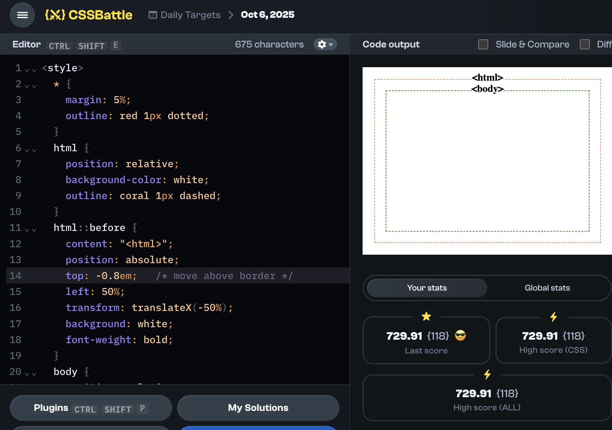

## Understand the CSSBattle environment

The preview area (where you see your output) is an `iframe` with a fixed size of **400px × 300px**.

By default the environment already includes the root `<html>` and `<body>` elements, so you use them directly for styling.



<details>
  <summary>See it yourself</summary>
  
  Go to any challenge (for example: [this one](https://cssbattle.dev/play/abNemelD1dcMFPGh7PeU)) and paste the following code:
  
  ```html
  <style>
  * {
    margin: 5%;
    outline: red 1px dotted;
  }
  html {
    position: relative;
    background-color: white;
    outline: coral 1px dashed;
  }
  html::before {
    content: "<html>";
    position: absolute;
    top: -0.8em;   /* move above border */
    left: 50%;
    transform: translateX(-50%);
    background: white;
    font-weight: bold;
  }
  body {
    position: relative;
    background-color: white;
    outline: green 1px dashed;
  }
  body::before {
    content: "<body>";
    position: absolute;
    top: -0.8em;   /* move above border */
    left: 50%;
    transform: translateX(-50%);
    background: white;
    font-weight: bold;
  }
</style>
  ```
  
</details>