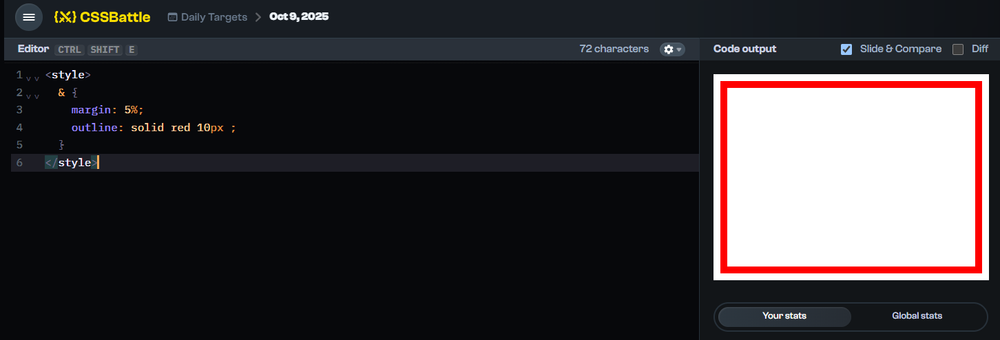

# Understand the CSSBattle environment

The preview area (where you see your output) is an `iframe` with a fixed size of **400px × 300px**.

By default the environment already includes the root `<html>` and `<body>` elements, so you use them directly for styling.


<details>
  <summary>See it yourself</summary>
  
  Go to any challenge (for example: [this one](https://cssbattle.dev/play/abNemelD1dcMFPGh7PeU)) and paste the following code:
  
  ```html
  <style>
  * {
    margin: 5%;
    outline: red 1px dotted;
  }
  html {
    position: relative;
    background-color: white;
    outline: coral 1px dashed;
  }
  html::before {
    content: "<html>";
    position: absolute;
    top: -0.8em;   /* move above border */
    left: 50%;
    transform: translateX(-50%);
    background: white;
    font-weight: bold;
  }
  body {
    position: relative;
    background-color: white;
    outline: green 1px dashed;
  }
  body::before {
    content: "<body>";
    position: absolute;
    top: -0.8em;   /* move above border */
    left: 50%;
    transform: translateX(-50%);
    background: white;
    font-weight: bold;
  }
</style>
  ```
  
</details>

# Tip and tricks
> [!IMPORTANT]  
> Please dont use them in production.

## A. Selectors
### 1. CSS Nesting

[CSS nesting](https://developer.mozilla.org/en-US/docs/Web/CSS/CSS_nesting/Using_CSS_nesting) is one of the most commonly used syntaxes in CSSBattle.

The syntax look like this:
```css
* {
  * {
    * {
    }
  }
}
```
#### Understand CSS nesting examples
##### CSS nesting with the `var` function
It is a very powerful way to style dynamic elements and is very common in CSSBattle.

```html
<style>
* {
  background: var(--m, #588A95);
  * {
    width: 140px;
    height: 140px;
    margin: 20% auto;
    --m: #222;
    * {
      --m: #fff;
      transform: skew(45deg);
    }
  }
}
</style>
<p></p>
```

In this case, it is the same as:

```css
html {}
body {}
p {}
```

Instead of writing:

```css
html {
  background-color: var(--m, #588A95);
}

body {
  width: 140px;
  height: 140px;
  margin: 20% auto;
  background-color: var(--m, #222);
}
```

Since they share the same `background-color` property, we can do something like:

```css
html {
  background-color: var(--m, #588A95);
  body {
    width: 140px;
    height: 140px;
    margin: 20% auto;
    --m: #222;
  }
}
```

Here, the `body` element inherits the `background-color` from `html`, but it can also define its own background color value (`#222`).

You can see its usage in [2025-Oct-06th challenge](./2025/Oct/6th.md)

##### The `&` selector
[MDN link for the `&` selector](https://developer.mozilla.org/en-US/docs/Web/CSS/Nesting_selector)

```css
a {
  &:hover {
    background: green;
  }
}
```
The above code is equivalent to:
```css
a:hover {
  background: skyblue;
}
```
In CSSbBattle we can use `&` at root to select the `html` element;
```html
<style>
  & {
    margin: 5%;
    outline: solid red 10px ;
  }
</style>
```



### 2. Attribute selectors
This is a very powerful way to select elements for formatting.
[Read more](https://developer.mozilla.org/en-US/docs/Web/CSS/Attribute_selectors)

Example:
Instead of using `<p class="a"></p>`, we can simply write `<p a>`.
To target it in CSS, we can use `p[a]`:

```css
  p[a] {
    color: skyblue;
  }
```

# Get top submissions

Click on `Top solutions` and run this:
```javascript
// returns a markdown string for up to `limit` submissions
function topSubmissionsToMarkdown(limit = 10) {
  const base = 'https://cssbattle.dev';
  const nodes = Array.from(document.querySelectorAll('.top-submission-container')).slice(0, limit);

  function extractScoreInfo(scoreText) {
    // examples of scoreText: "Score: 707.36 {138}, 100% match"
    const charsMatch = scoreText.match(/\{(\d+)\}/);
    const percentMatch = scoreText.match(/(\d+)%\s*match/);
    return {
      characters: charsMatch ? charsMatch[1] : '',
      percent: percentMatch ? percentMatch[1] + '%' : ''
    };
  }

  return nodes.map((el, idx) => {
    // author link & name
    const a = el.querySelector('.top-submission__author a.name-link') || el.querySelector('.top-submission__author a.avatar-link');
    const href = a ? (a.getAttribute('href') || '') : '';
    const fullHref = href.startsWith('http') ? href : (base + href);
    const name = (el.querySelector('.name-link span') || el.querySelector('.top-submission__author a.name-link'))?.textContent?.trim() || (a?.getAttribute('aria-label') || '').replace('@','');

    // score line (contains chars and %match)
    const scoreLine = (el.querySelector('.top-submission__author__score')?.textContent || '').trim();
    const { characters, percent } = extractScoreInfo(scoreLine);

    // code content (raw text inside the code editor)
    const codeNode = el.querySelector('.cm-content') || el.querySelector('.submissions-list__code');
    // prefer .textContent to preserve original characters/newlines
    const code = codeNode ? codeNode.textContent.trim() : '';

    return `#### ${idx+1}. [${name}](${fullHref}) ${percent} match, ${characters} characters\n\`\`\`html\n${code}\n\`\`\``;
  }).join('\n\n');
}

// Example usage:
console.log(topSubmissionsToMarkdown(10));
```